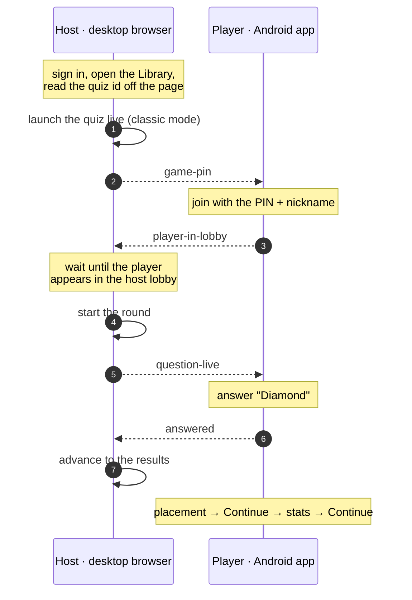

# Live Kahoot, across two devices

A quiz **host** driving a real desktop browser and a **player** on the native
Kahoot Android app play one live game together — in a single Kraken scenario.
The host signs in on the web, launches a quiz, and shares the game PIN; the
player joins from the phone, answers the question, and both sides walk out
through the end-of-game screens. Neither device ever races ahead of the other.

This is the interoperability story on a production application: real sign-in,
real consent sheets, real loaders and countdowns, a real game PIN — no fixture,
no mock backend. It lives in the repository at `examples/real-apps/kahoot/`.

::: info 📹 Media placeholder — demo recording
Embed a screen recording of a full run here (host browser and phone
side by side). Suggested: a ~40-second capture from `npx kraken run`, exported
as an MP4/WebM and dropped in `apps/docs/public/media/kahoot-run.mp4`, then
referenced with a `<video>` tag. A silent, captioned clip reads best in docs.
:::

## What happens

<!-- Rendered by vitepress-plugin-mermaid -->



The dashed arrows are **signals** — the append-only, replay-first channel Kraken
actors use to coordinate across devices (see [Signals](/guide/signals)). Each
one is a hand-off: the PIN travels from host to player, the player's arrival and
answer travel back, and the question going live travels forward. The solid
arrows are one device acting on its own screen.

## The shape of the project

A real-app suite is a self-contained Kraken project. From its own directory
every command runs with no flags, because the config file is the conventional
`kraken.config.ts`:

```
kahoot/
  kraken.config.ts        the two actors, their drivers, run-wide policies
  features/
    live-quiz.feature     the scenario in Given/When/Then
  steps/
    index.ts              thin steps → Screen Objects + signal choreography
  screens/
    web/                  login, library, live game (host)
    mobile/               the player's join → answer → finish flow
  support/                locator factories and small wait helpers
  .env / .env.host        run parameters and credentials (git-ignored)
```

```bash
npx kraken run              # the whole scenario
npx kraken run --dry-run    # compile + deadlock analysis, no devices
npx kraken inspect host     # click-to-identify selectors on the browser
npx kraken inspect player   # …or on the phone
```

If the Android emulator is not running, Kraken boots the configured AVD before
the run. Every step leaves a screenshot under `.kraken/runs/<id>/`, a visual
timeline of the session.

::: info 🖼️ Media placeholder — the two screens
Add two screenshots side by side: the host's live game (browser) and the
player's answer screen (phone). Drop them in `apps/docs/public/media/` and
reference with standard markdown images. They anchor the reader in what each
device actually shows.
:::

## Ideas worth copying

The suite is meant to be read and reused. A few decisions carry beyond Kahoot.

### Nothing is hardcoded

The quiz id is read off the Library page at run time rather than pasted into the
config, so renaming the quiz, re-creating it, or switching accounts never breaks
the suite. Reading page data the portable operations don't expose is exactly
what the web session's `evaluate` escape hatch is for:

```ts
// LibraryPage — read the quiz id from the card the user names.
const result = await this.session.evaluate(FIND_QUIZ_ID, name);
```

### Cross-device sync anchors on the receiver's own truth

A signal is a hand-off, not a guarantee the other side is ready. The player
publishes `player-in-lobby` the moment its **device** shows it has joined — but
that can beat the game server's registration, so the player may not yet appear
in the **host's** lobby. Starting then makes Kahoot reject an empty game. The
host therefore waits until it sees the participant in its own lobby before
starting:

```ts
// GameHostPage.startRound — the real synchronization point.
await this.session.waitFor(ANY_PARTICIPANT, 'visible', { timeoutMs: 120_000 });
await this.session.tap(START_GAME);
```

The principle generalizes: **wait on the state you depend on, not merely on the
message that announces it.**

### Each side identifies what its own screen shows

The classic game looks different on each device, and the suite leans into that
rather than fighting it. On the phone, the answer options are four colored
**shapes with no visible text and no question** — the question lives on the
host's screen only — so the player identifies the answer tile by its
accessibility label, not by any wording:

```ts
// PlayerApp.answer — the shape name lives in the content description.
await waitForAny(this.session, [a11y(shape), /* …fallbacks */], { timeoutMs: 90_000 });
```

### Every hop waits on the next screen's anchor

There are no fixed sleeps. Kahoot's loaders, countdowns and cross-fade
transitions are absorbed by waiting for the element that proves the next screen
arrived — the classic-mode tile, the game PIN, the participant entry — and the
web driver extends its own wait budget when the page navigates mid-wait.

### Secrets are layered

Shared, non-secret run parameters live in `.env`; the host's credentials live in
`.env.host`, wired to that one actor; the player's nickname is inline config
data. Steps read all of it from `actor.data` — never from the repository.

## Working against a moving target

Production apps change their markup. When a selector stops matching, run
`npx kraken inspect host` (or `player`), click the element, and paste the
recommended locator into the one Screen Object that owns it. The inspector ranks
candidates by page-wide uniqueness, so what you paste is what the run will find.

::: tip A note on native performance
Modern apps animate continuously, and UiAutomator2 blocks each command until the
screen is idle — on a never-idle animated screen that stalls every lookup. The
Android driver caps this wait so commands stay responsive; explicit `waitFor`
polling still absorbs any mid-transition miss. This is handled for you, but it
is worth knowing when you write your own native flows.
:::

## Setup in brief

A throwaway Kahoot account with a quiz named `Kraken e2e` (one question, correct
answer on the **Diamond** tile), the Kahoot app installed and signed in on the
emulator, and two environment files copied from their `.example` templates. The
full checklist is in the suite's `SETUP.md`.
